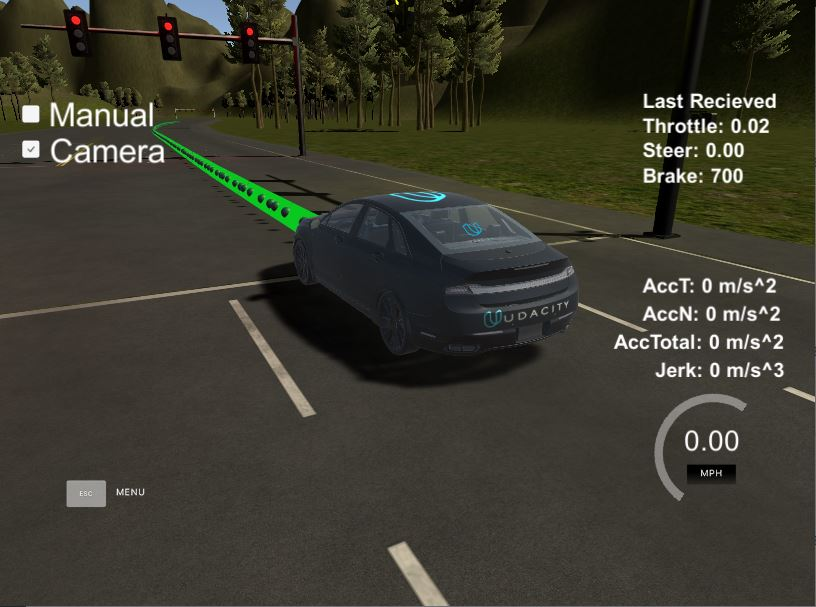
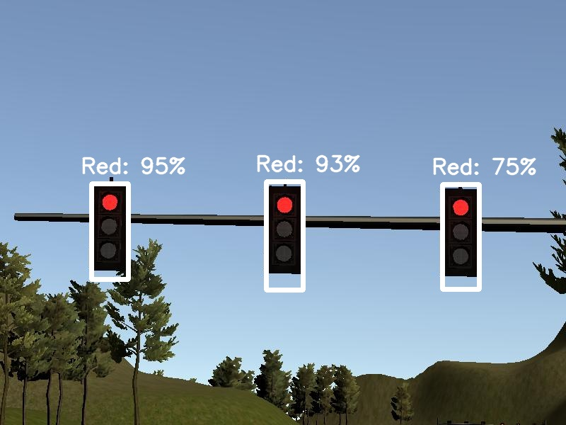
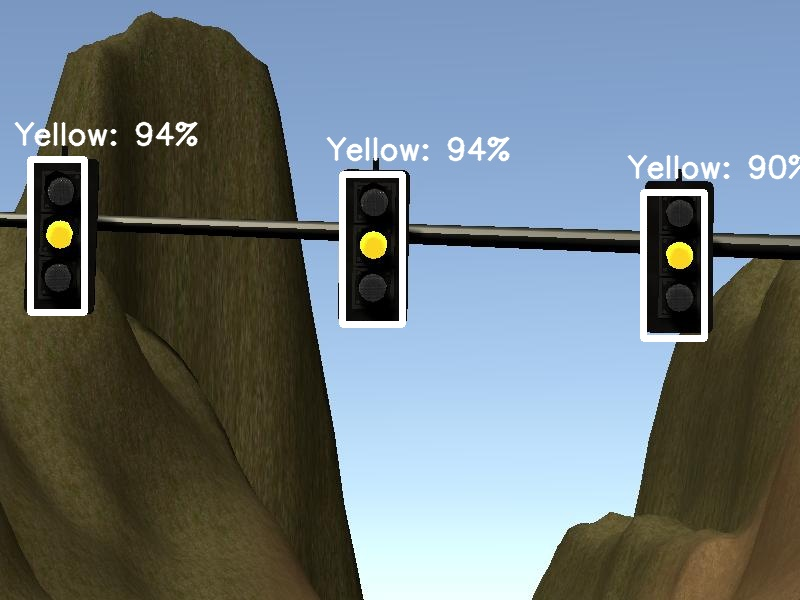
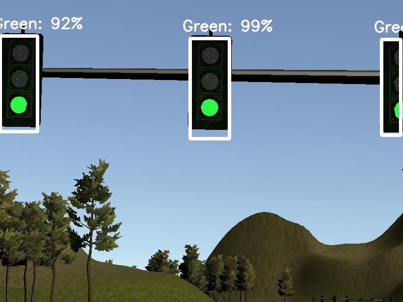
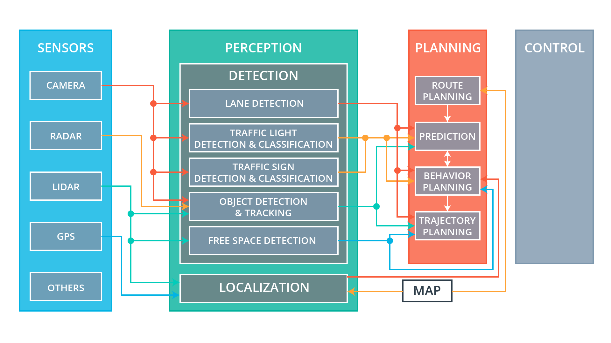
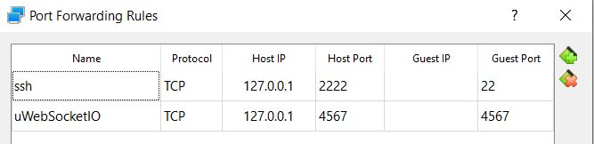
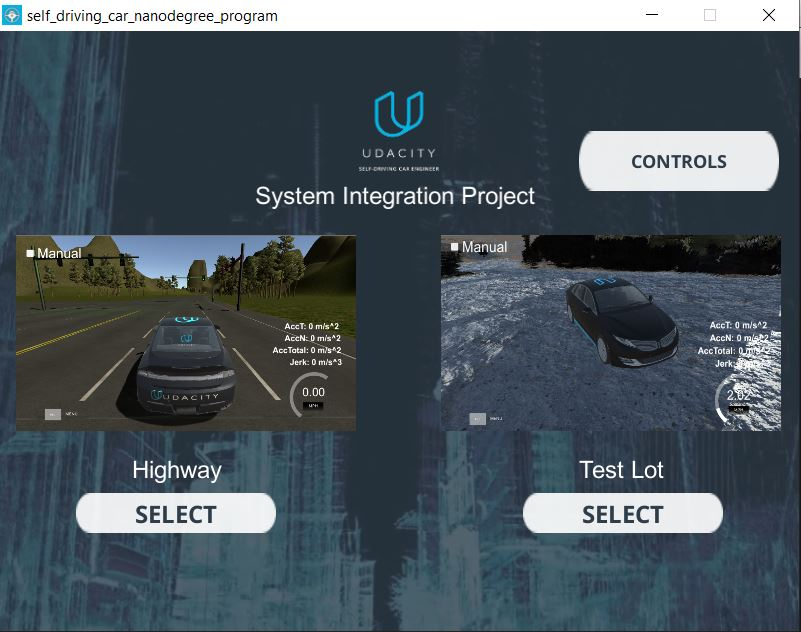
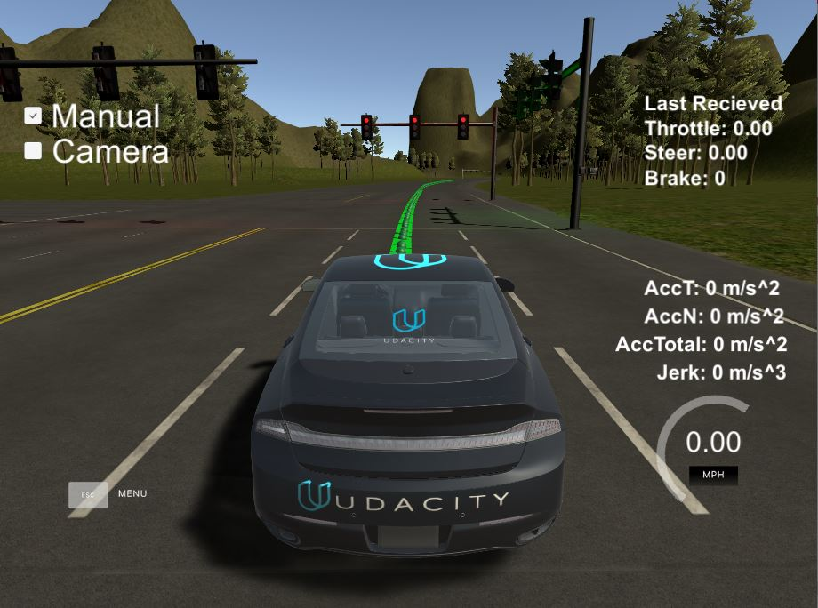
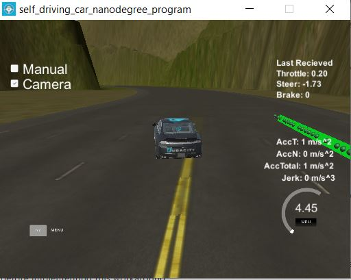

# Project: End to End Self-Driving Car Software

[](http://www.udacity.com/drive)

This Robotics Deep Learning application's goal is to safely maneuver a car around a virtual highway while stopping at red traffic lights by using perception, path planning and control modules through system integration. 



This Robotics Deep Learning application also features a traffic light classifier that detects and recognizes traffic lights in the simulator.

Here is an example of the traffic light classifier in action recognizing a red traffic light:



Here is an example of the traffic light classifier in action recognizing a yellow traffic light:



Here is an example of the traffic light classifier in action recognizing a green traffic light:



Mainly we care about the red traffic light because that tells the car to stop driving and any traffic light color other than red
tells the car to keep driving. For further practicing traffic light detection and recognition, check out this [object detection
jupyter notebook](./docs/object_detection/CarND-Object-Detection-Lab.ipynb).

Check out my youtube video [End to End Self-Driving Car Application Demo](https://youtu.be/VpctJ7Kvmv4) where I test the car to maneuver around the virtual highway with traffic lights at each intersection while dealing with camera latency issues between the system integration simulator and the ROS system.

Overview
---

The purpose of this project was to implement a perception, path planning and control subsystem in Python within the current software infrastructure for an End to End Self-Driving Car Robotics application provided by Udacity. In this project, one learns to write ROS nodes to implement core functionality of the autonomous vehicle system, which included traffic light detection, control and waypoint following. For the next part of the project, one tests their code using Udacity's System Integration Simulator. Once the car is able to drive safely around the virtual highway and stop at red street lights, one is done with the simulator portion of the project and as an individual can submit the project. The alternative extended project was to form groups in which after a group tests their code in the simulator and feel ready, they would be able to submit their project for Udacity to then deploy and test on Carla, Udacity's real self-driving car. Due to the limited time I had left to complete the project, I decided to work on the project as an individual. So, I will be walking you through my experience developing the self-driving car software and testing it in the simulator.

Contents
---

- **[config/](config/)**: contains configuration files from the Tensorflow Object Detection API for configuring the way you want your model to be trained
- **[data/](data/)**: contains the simulator waypoints, udacity label map for traffic lights and other data. You could download your training data and evaluation data into this folder.
- **[docs](docs)**: contains images for the README and helpful for debugging, getting started notebook on object detection using transfer learning
- **[ros/](ros/)**: contains the ROS application, which consists of multiple ROS packages that make up the software for the end to end self-driving car from perception, path planning to controls
- **[tensorflow/](tensorflow/)**: you may not be able to see this folder, but it is important, I used it for storing the object detection models I downloaded from the Tensorflow Object Detection API, which then were trained on the traffic light dataset, which were exported as frozen graphs, which are used in the tl_classifier.py script in the ROS application
- **[Dockerfile](Dockerfile)**: Dockerfile can be used with docker build command to build a docker image with the software development environment for this project
- **[export_inference_graph.py](export_inference_graph.py)**: brought in from Tensorflow Object Detection API, a Python script for exporting model checkpoints as frozen graphs that can be used for classification in the project. I used Tensorflow 1.4.0 to export the model as frozen graphs.
- **[train.py](train.py)**: brought in from Tensorflow Object Detection API, a Python script for training a pretrained model on new data to specialize that model in a particular area, such as traffic light classification
- **[requirements.txt](requirements.txt)**: contains the python modules and their versions needed for the project. You could also download python modules that are compatible with the versions specified.
- **README**: explains project overview, contents, reflection of how I developed the software for the project, steps on how to run the demo

- **[src/main.cpp](src/main.cpp)**: main file is executed after running **./run.sh** shell script. main.cpp acts as a web server that reads crosstrack error and speed data from the simulator client. Then it processes that data to calculate the steering angle and throttle, which is passed as a JSON message to the simulator to control the car's steering and speed.

Reflection
---

First, I will cover the self-driving car architecture used for this project at a high level and then a lower level with ROS.

Here is a high level diagram of the autonomous vehicle system architecture used for this project:



In a self-driving car system, we work with sensors, perception, planning and control. For this project, I worked with various sources of data that come from sensors, such as position, velocity, acceleration and image data. For perception, I used components of the detection stack, such as traffic light detection and classification and even some concepts from lane detection. For planning, I used components from that stack, such as route planning and behavior planning. Finally, the control subsystem was important for controlling the car's throttle, steering and brake. The system integration is the process I went through to integrate these subystems together. 

Here is a lower level diagram showing ROS nodes and topics used in this project:


### Code Structure

All the code for this project is contained iin the `path/to/ros/src/` directory. The ROS packages that I did development in included: **tl_detector/**, **waypoint_updater/**, **twist_controller/**. 

### Perception: Traffic Light Detection Node

The tl_detector package contains a traffic light detection node `tl_detector.py` that ingests data from **/base_waypoints**, **/image_color** and **/current_pose** topics and outputs data into the **/traffic_waypoint** topic. My development focus in this package was to proccess traffic light data. So, working with the car's current position, base waypoints and traffic light data, I found the closest traffic light's stop line, classified the traffic light state using a pretrained SSD MobileNet V1 model and determined if the car needed to stop or not. I also worked on developing the traffic light classifier. Since I already some experience with developing models from scratch, I wanted to gain more hands on experience with transfer learning. So, I referenced the object detection lesson, then learned how to work with SSD MobileNet and SSD Inception models to train the models on traffic lights and export them as frozen graphs. The SSD MobileNet V1 frozen graph was then used in the `tl_classifier.py` script to detect and classify traffic lights in the simulator. Also, for tl_detector.py, I modified the **camera images processing rate** to be processed every **250 milliseconds**. I set a **waypoint threshold to be 150**, so the traffic light classifier is only used once the car is within 150 waypoints of the traffic light. I applied a camera image processing rate and waypoint threshold to help with the **simulator camera latency issue**. I found these updates to the code helped with decreasing lag experienced in the simulator, but there was still lag in some parts of the simulator. Feel free to reference the code on how I did this below.

Adjusting the camera image processing rate and waypoint threshold should help with the camera latency issues in the simulator:

~~~python
# tl-detector.py 
# tuning the camera image processing rate and waypoint threshold

CAMERA_IMAGE_PROCESSING_RATE = 0.250 # process camera image every 250 milliseconds
# don't process camera image if waypoints between car and stop line waypoint are 
# below waypoint threshold 
WAYPOINT_THRESHOLD = 150

## other code inside TLDetector class
# __init__()
def __init__(self):
    # set to 0 since we haven't processed an image yet
    self.last_image_processed = 0

# image_cb() apply camera image processing rate
def image_cb(self, msg):

    # the current code ...

    # Get time elapsed, then check has 250 milliseconds passed, so we can process image
    self.time_elapsed = default_timer() - self.last_image_processed
    if self.time_elapsed < CAMERA_IMAGE_PROCESSING_RATE:
        # rospy.loginfo("time_elapsed < CAMERA_IMAGE_PROCESSING_RATE: t.e. = %s", self.time_elapsed)
        return
    
    self.camera_image = msg
    self.last_image_processed = default_timer()

    # remaining code ...

# process_traffic_lights() apply waypoint threshold
def process_traffic_lights(self):

    # the current code ...

    # Start using traffic light classifier once car is within waypoint threshold from traffic light
    if closest_light and ( (line_wp_idx - car_wp_idx) <= WAYPOINT_THRESHOLD ):
        state = self.get_light_state(closest_light)
        # rospy.loginfo("return line_wp_idx = %s", line_wp_idx)
        return line_wp_idx, state  

    # remaining code ...
~~~

You can also look at the code directly **[tl_detector.py](ros/src/tl_detector/tl_detector.py)**

### Datasets

For deep learning part of perception, I knew I was going to need a dataset to train the model on traffic lights from the simulator. I did think about building my own dataset like I did for behavioral cloning, but then I thought it may be more convenient to use an already existing dataset created from the simulator. So, I did some research to see if anyone shared their simulator dataset. I found Alex Lechner's dataset for the simulator and the real world part of the self-driving car. I also found Vatsal's dataset too. So, I could focus on model training instead of dataset creation, I downloaded their already built datasets. Like I used Vatsal's dataset for training and Alex's dataset for evaluation/validation. I trained a SSD Inception V2 model and a SSD MobileNet V1 model on the traffic light dataset from the simulator. I found that through testing using my object detection notebook located in the docs folder, SSD MobileNet V1 performed better than SSD Inception V2. So, I chose SSD MobileNet for my model to use in the simulator for traffic light detection and classification.

- [Alex Lechner's Traffic Light Dataset](https://github.com/alex-lechner/Traffic-Light-Classification#datasets) (both simulator and real world)
- [Vatsal's Traffic Light Dataset](https://github.com/coldKnight/TrafficLight_Detection-TensorFlowAPI#get-the-dataset) (both simulator and real world)

### Planning: Waypoint Updater Node

The waypoint_updater package contains the waypoint updater node: `waypoint_updater.py`. This node updates the target velocity of each waypoint based on traffic light and obstacle detection data. This node gathers data from **/base_wayoints**, **/current_pose**, **/obstacle_waypoint** and **/traffic_waypoint** topics and outputs waypoints in front of car with velocities to the **/final_waypoints** topic. My development focus in the waypoint updater script was to get the closest waypoints in front of the car using KDTree, calculate the velocity and position at each waypoint while considering the deceleration calculation used on the velocity. Then I would make sure that data got publishedd to the final waypoints topic mentioned earlier. This **node publishes 25 lookahead waypoints to the final waypoints topic at 20Hz** since I found through trial and error that that speed works well with the **simulator camera latency issue**. I noticed as I decreased the lookahead waypoints and decreased the rate at which those waypoints are published, the simulator lag decreased allowing for the car to drive better. Although this helped, it didn't make the problem go away.

Adjusting the ROS publishing rate for closest waypoints in front of car for dealing with simulator camera latency:

~~~python
# Setting the amount of lookahead waypoints in front of car to smaller number
LOOKAHEAD_WPS = 25 # init = 200 Number of waypoints we will publish. You can change this number

# WaypointUpdater class

# loop() set publishing rate to 20Hz using rospy.Rate()
def loop(self):
    rate = rospy.Rate(20)
    while not rospy.is_shutdown():
        # the current code ...
        rate.sleep()
~~~

You can also look at the code directly **[waypoint_updater.py](ros/src/waypoint_updater/waypoint_updater.py)**

### Control: Drive-By-Wire Node

The drive-by-wire (dbw) package contains files that control the vehicle: `dbw_node.py`, `twist_controller.py`. The DBW node ingests data from **/current_velocity**, **/twist_cmd** and **/vehicle/dbw_enable** topics and processes the data to publish throttle, brake and steering commands to the **/vehicle/throttle_cmd**, **/vehicle/brake_cmd** and **/vehicle/steering_cmd** topics. My development focus with the twist controller was to implement the control, which causes the car brake at maximum when the car was going really slow or gradually brake if the car is going faster than we want. This control also returned steering using the yaw_controller based on linear velocity, angular velocity and current veloity. It calculated the throttle for each stop using the PID controller and passing into that controller the velocity error and sample time. Sample time is just the current ROS time minus the last ROS time. The DBW node calls on the twist controller control method to retrieve the throttle, brake and steering to publish those commands to the vehicle at 50Hz. 50Hz is needed for Carla because Carla is expecting the commands to be published at 50Hz to her drive-by-wire (dbw) system.  

### Simulator Communcation with ROS: Styx

The `styx` and `styx_msgs` packages are used to provide a link between the simulator and ROS. Styx is a package that contains a server for communicating with the Unity simulator and a bridge to translate and publish simulator messages to ROS topics. styx_msgs includes custom message types used in this project.

Setup Software Development Environment for Project
---

### Recommended VM Install: Udacity Ubuntu 16.04 VM Development Environment

1\. The recommended approach by the instructors of this project is to download [Udacity's Ubuntu 16.04 virtual machine](https://s3-us-west-1.amazonaws.com/udacity-selfdrivingcar/Udacity_VM_Base_V1.0.0.zip) that comes with ROS, Dataspeed DBW and other software installed to resemble as closely as possible the softare environment of Carla. Carla is Udacity's real self-driving car.

The virtual machine will require port forwarding to Udacity's simulator port, the image below shows an example of the port forwarded for uWebSocketIO in Virtualbox:



If you install Udacity's VM, you can skip the alternative installs and jump to **Udacity System Integration Simulator**. Its recommended that you download the simulator onto your host machine outside of the simulator for best performance.

### Alternative 1 Native Install: Ubuntu 16.04 Development Environment

Alternatively, you could natively install the software development environment to resemble the development environment of Carla.

1\. Minimum Hardware Specifications: **2 CPU**, **2 GB system memory**, **25GB of free hard drive space**

2\. Your workstation must be running **Ubuntu 16.04** Xenial Xerus. [Link to Ubuntu Downloads](https://www.ubuntu.com/download/desktop)

3\. Install [ROS Kinetic](http://wiki.ros.org/kinetic/Installation/Ubuntu) for Ubuntu 16.04

4\. Install [Dataspeed DBW](https://bitbucket.org/DataspeedInc/dbw_mkz_ros). **Note:** DBW is a **dbw_mkz** ROS package, so feel free to look up how to install it with ROS once ROS is already installed.

### Alternative 2 Docker Install: Ubuntu 16.04 Development Environment

Alternatively, you could install Docker and build Udacity's Docker image, which is similar to Udacity's Virtual Machine environment, but uses Docker instead.

1\. [Install Docker](https://docs.docker.com/engine/installation/)

2\. Build the Docker image from Udacity's Dockerfile

~~~
git clone https://github.com/udacity/CarND-Capstone
cd path/to/CarND-Capstone
docker build . -t capstone
~~~

3\. Deploy a Docker container from the Docker image

~~~
docker run -p 4567:4567 -v $PWD:/capstone -v /tmp/log:/root/.ros/ --rm -it capstone
~~~

### Udacity System Integration Simulator

This project requires the **Udacity System Integration Simulator**, which can be downloaded from this [GitHub Link: System Integration v1.3](https://github.com/udacity/CarND-Capstone/releases). Note: If you developing the self-driving car software in a virtual machine, it is recommended that you download Udacity's simulator on your host machine.

Dependencies for Running Project Demo
---

* cmake >= 3.5
 * All OSes: [click here for installation instructions](https://cmake.org/install/)
* make >= 4.1(mac, linux), 3.81(Windows)
  * Linux: make is installed by default on most Linux distros
  * Mac: [install Xcode command line tools to get make](https://developer.apple.com/xcode/features/)
  * Windows: [Click here for installation instructions](http://gnuwin32.sourceforge.net/packages/make.htm)
* gcc/g++ >= 5.4
  * Linux: gcc / g++ is installed by default on most Linux distros
  * Mac: same deal as make - [install Xcode command line tools]((https://developer.apple.com/xcode/features/)
  * Windows: recommend using [MinGW](http://www.mingw.org/)
* [uWebSockets](https://github.com/uWebSockets/uWebSockets)
  * Run either `./install-mac.sh` or `./install-ubuntu.sh`.
  * If you install from source, checkout to commit `e94b6e1`, i.e.
    ```
    git clone https://github.com/uWebSockets/uWebSockets 
    cd uWebSockets
    git checkout e94b6e1
    ```

How to Run Demo
---

### Build & Compile ROS Program

1\. Clone the project repository

```bash
git clone https://github.com/james94/Capstone-Program-Autonomous-Vehicle-CarND
```

2\. Install python dependencies

```bash
cd CarND-Capstone
pip install -r requirements.txt
```

3\. Make and run styx
 
```bash
cd ros
catkin_make
source devel/setup.sh
roslaunch launch/styx.launch
```

### Launch the Simulator and Connect the ROS Program

4\. Run the simulator



### Test ROS Self-Driving Car on Virtual Highway

Before you select the virtual highway, make sure to launch your ROS program. Wait
about 5 seconds for your ROS program to load, then select the simulator level.
Next press **camera**, there should be a checkbox. You'll notice the Manual checkbox is
checked, uncheck it once **camera** is checked.



Note: In the image above, I was testing how 100, 150, 200 lookahead waypoints affected the simulator,
I found the more I decreased lookahead waypoints, the better the car performed in the simulator.

If you have executed the ROS program, the car should start driving forward, stop at traffic lights
if they are red and keep driving when safe. You may notice some lag from the simulator, this usually
happens from running the camera. I hear this happens often for windows and mac users, but less often
for linux users.

To pass the project, I verified the requirements for the Udacity submission checklist:

- I am able to launch the ROS program using the launch files provided in the repo.
- My virtual car is able to follow waypoints smoothly (With the camera off in the simulator). When the camera is on, at certain points in the virtual highway my vehicle's ability to follow waypoints is disrupted.
- My vehicle's top speed was 23.9 mph (38.4 kph), which adheres the top speed set for waypoints `twist.twist.linear.x`, which is 40kph.
- My vehicle is able to stop at traffic lights at the appropriate time (I did notice the car did run through some red lights when the simulator lagged from camera latency)
- In my Twist Controller control, I specify the code to reset the Throttle PID controller and stop the vehicle based on the state of `/vehicle/dbw_enabled`
- Throttle, steering and brake commands are published at 50Hz

Conclusion
---

Following the steps above, we just ran the demo for an End to End Self-Driving Car software application with a Unity simulator. We followed waypoints on the virtual highway using the Path Planner, recognized red traffic lights using Traffic Light Classification, adjusted the car's brake, speed and steering using a Twist Controller. By performing system integration to integrate the vehicle subsystems: perception, path planning and control, the car was able to drive safely around the virtual highway and stop at traffic lights if they are red else the car keeps going. The result was that the car was able to drive safely around the virtual highway through all 8 traffic light intersections while stopping when needed. The most challenging part of the project was tuning the ROS software system to minimize camera latency coming from the Unity simulator. The camera data was needed, so we could use our traffic light classifier to detect and classify traffic light state, allowing the car to know when to stop at a traffic light. So, the speed of camera image dataflow between the ROS system and the simulator was critical, so the car could make timely stops at traffic lights that would be safe along with driving safe on the virtual highway. With the proper tuning to the ROS system discussed in the reflection earlier, I was able to get rid of most of lag in the simulator. The other most challenging part of the project was working with multiple different versions of Tensorflow on my local laptop. Since I had limited time to finish this project, I decided to work on it as an individual and mainly focus on getting the car to drive safely in the virtual environment. If I had more time, I would have formed a team and tested my ROS software on Udacity's real self-driving car to see if it drove safely in their real test environment.

If I had more time, I would have further tried to resolve the camera latency issues happening in the simulator on Windows 10:



When the car approached these green mountains, I noticed the lag was really bad. There were other parts of virtual highway that also experienced heavy latency. From my research, I found some people who had the software development environment installed on native linux with the remedies we discussed earlier for minimizing camera latency were able to resolve these latency issues. However, I noticed a lot of Udacity students like myself who only used the Ubuntu 16.04 Virtual Machine provided by Udacity running on Windows 10 or Mac OS X experienced lag issues in the simulator even after applying the remedies for reducing camera latency. I even noticed there are issues open on GitHub about the camera latency issues: **[turning on the camera slows car down so auto-mode gets messed up](https://github.com/udacity/CarND-Capstone/issues/266)**. Overall, I would recommend this project as it is a great experience for learning how to build the software for an end to end self-driving car robotics and deep learning application.

Resources
---

- Udacity SDCE-ND: Autonomous Vehicle Curriculum
    - Course 1: Computer Vision
    - Course 2: Deep Learning
    - Course 3: Sensor Fusion
    - Course 4: Localization
    - Course 5: Path Planning
    - Course 6: Control
    - Course 7: System Integration
    - Course X: Additional Content
      - Lesson 1: Object Detection

- Helpful GitHub Repositories
  - [alex-lechner: Traffic Light Classification](https://github.com/alex-lechner/Traffic-Light-Classification)
  - [josehoras: Capstone: Program an Autonomous Vehicle](https://github.com/josehoras/Self-Driving-Car-Nanodegree-Capstone)
  - [rosocz: CarND-Capstone](https://github.com/rosocz/CarND-Capstone)
  - [Tensorflow Object Detection API](https://github.com/tensorflow/models/tree/master/research/object_detection)
  - [Protocol Buffers v3.4.0](https://github.com/protocolbuffers/protobuf/releases/tag/v3.4.0) needed for Windows 10!

- Blog Posts
  - [Installing TensorFlow Object Detection API on Windows 10](https://medium.com/@marklabinski/installing-tensorflow-object-detection-api-on-windows-10-7a4eb83e1e7b)

- Helpful GitHub Issues
  - [Tensorflow Object Detection API on Windows - error "MobuleNotFoundError: No module named 'utils'"](https://github.com/tensorflow/models/issues/3164)

### Appendix A: Training and Exporting Model

Train SSD MobileNet v1

~~~bash
python train.py \
--logtostderr \
--train_dir=./tensorflow/models/train/ssd_mobilenet/ssd_mobilenet_v1_tl /
--pipeline_config_path=./config/ssd_mobilenet_v1_coco.config

python export_inference_graph.py \
--input_type=image_tensor \
--pipeline_config_path=./config/ssd_mobilenet_v1_coco.config \
--trained_checkpoint_prefix=./tensorflow/models/train/ssd_mobilenet/ssd_mobilenet_v1_tl/model.ckpt-2000 \
--output_directory=./tensorflow/models/output/trained/ssd_mobilenet/ssd_mobilenet_v1_tl/
~~~

Train SSD Inception V2

~~~bash
python train.py \
--logtostderr \
--train_dir=./tensorflow/models/train/ssd_inception/ssd_inception_v2_tl /
--pipeline_config_path=./config/ssd_inception_v2_coco.config

python export_inference_graph.py \
--input_type=image_tensor \
--pipeline_config_path=./config/ssd_inception_v2_coco.config \
--trained_checkpoint_prefix=./tensorflow/models/train/ssd_inception/ssd_inception_v2_tl/model.ckpt-2000 \
--output_directory=./tensorflow/models/output/trained/ssd_inception/ssd_inception_v2_tl/
~~~

